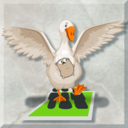

# goose - OpenSimulator toolkit written in Go

This is an assorted collection of tools to deal with OpenSimulator chores that are too fancy to be written in shell script, so I'm doing them in Go instead.

## License

Source code licensed under a [MIT license](https://gwyneth-llewelyn.mit-license.org/).

The base image for the logo (the goose) is [an image by brgfx on Freepik](https://www.freepik.com/free-vector/goose-animal-farm-animal-cartoon-sticker_21303377.htm#query=goose&position=1&from_view=keyword&track=sph). The Gopher mascot is a design of Renée French, used with permission on any Go-related project. The OpenSimulator logo has been placed by Adam Frisby in the public domain, as far as I could trace it (2007).

## Workflows

